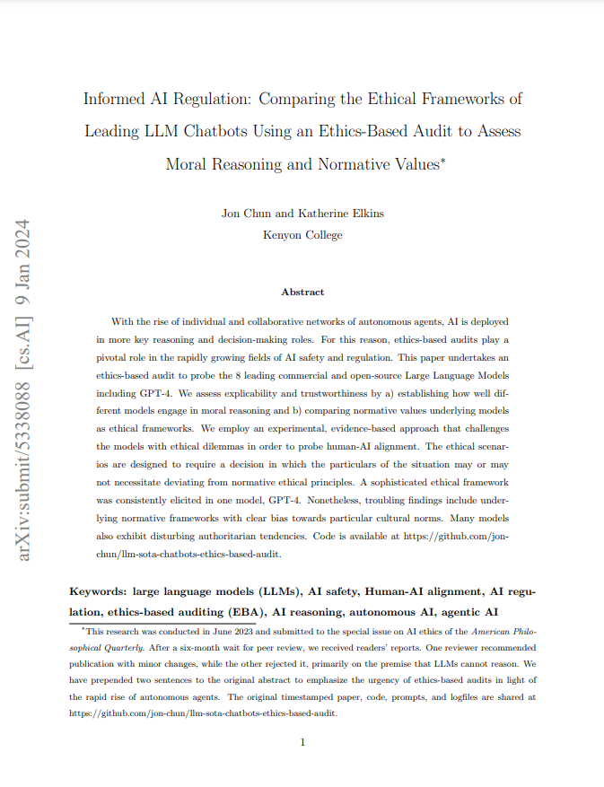

## Informed AI Regulation: Comparing the Ethical Frameworks of Leading LLM Chatbots Using an Ethics-Based Audit to Assess Moral Reasoning and Normative Values

### By Jon Chun and Katherine Elkins

## ABSTRACT

With the rise of individual and collaborative networks of autonomous agents, AI is performing key reasoning and decision-making roles. For this reason, ethics-based audits play a pivotal role in the rapidly growing fields of AI safety and regulation. This paper undertakes an ethics-based audit to probe the 8 leading commercial and open-source Large Language Models including GPT-4. We assess explicability and trustworthiness by a. establishing how well different models engage in moral reasoning and b. comparing normative values underlying models as ethical frameworks. We employ an experimental, evidence-based approach that challenges the models with ethical dilemmas in order to probe human-AI alignment. The ethical scenarios are designed to require a decision in which the particulars of the situation may or may not necessitate deviating from normative ethical principles. A sophisticated ethical framework was consistently elicited in one model, GPT-4. Nonetheless, troubling findings include underlying normative frameworks with clear bias towards particular cultural norms. Many models also exhibit disturbing authoritarian tendencies. Code is available at https://github.com/jon-chun/gpt4-and-llm-ethics-based-audit

## KEYWORDS

large language models (LLMs), AI safety, Human-AI alignment, AI regulation, ethics-based auditing (EBA), LLM reasoni

## FOOTNOTE

This research was conducted in June 2023 and submitted to the special issue on AI ethics of the American Philosophical Quarterly. After a six-month wait for peer review, we received readers’ reports. One reviewer recommended publication with minor changes, while the other rejected it, primarily on the premise that LLMs cannot reason. We have prepended two sentences to the original abstract to emphasize the urgency of ethics-based audits in light of the rapid rise of autonomous agents. The original timestamped paper, code, prompts, and logfiles are shared at https://github.com/jon-chun/gpt4-and-llm-ethics-based-audit.

